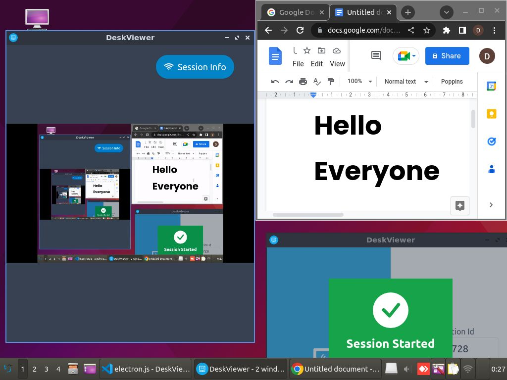
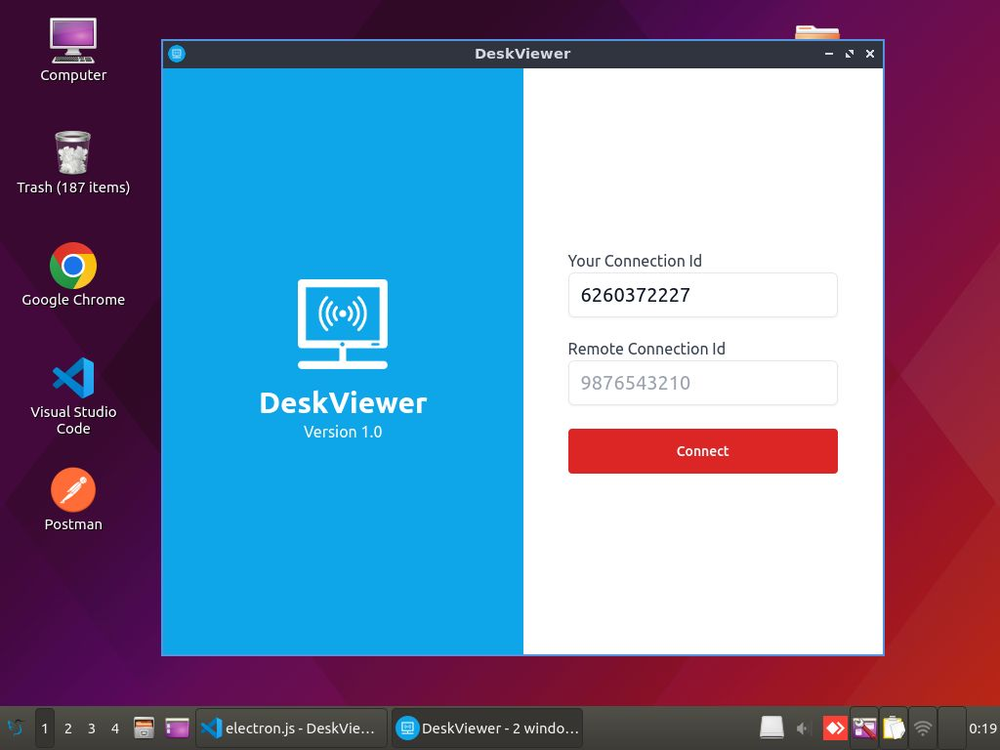
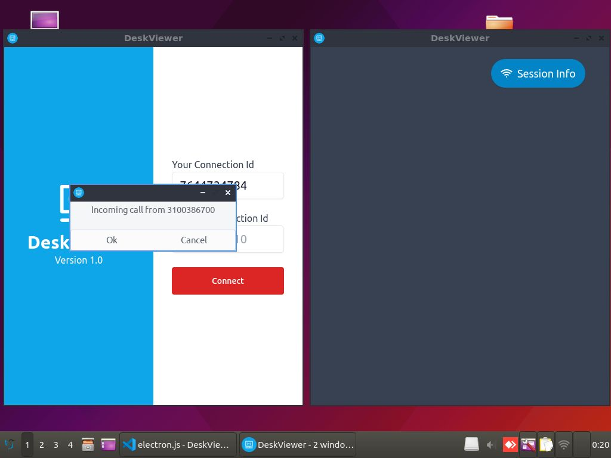
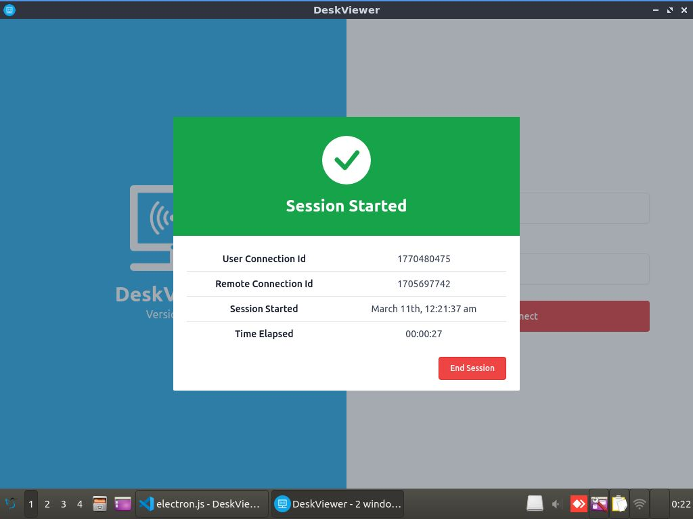

# DeskViewer
**DeskViewer** is a cross platform remote desktop controlling application that allows users to access and control a remote computer from anywhere in the world

## About :dart:
DeskViewer establishes a **peer-to-peer (P2P) connection** between 2 devices for enabling screen share and makes use of **websockets** to emit keyboard and mouse events. Additionally, the 2 peers can also talk to each other using realtime voice transmission!
 
## Demo
Since the build size for .exe, .app and linux executable file exceeds over 200Mb, I have not uploaded the executable files in this repository. However, I have shared a video demo of this project in the link below. Additionally, I have also explained how you can easily generate an executable file of this project for windows, mac and linux!

## Video Demo 
Here is a short video on how to use DeskViewer

## DeskViewer Features :fire:
- **Screen Sharing** - User can share his screen to a remote user
- **Screen Control** - Remote user can in return control the keyboard and mouse of connected user
- **Audio Sharing** - Both users can talk to each other in realtime

## :camera_flash: Screenshots :computer:
|   |   |   |
|---|---|---|
| | 
| | 

## Built Using :bulb:
- **Electron** - For building the desktop application
- **PeerJs** - For transmitting screen video and user audio in realtime
- **Socket.io** - For emitting mouse and keyboard events
- **RobotJs** - For triggering mouse movement and keystrokes on remote device
- **NodeJs** - For creating a custom P2P server along with websockets
- **React** - For reusing design components
- **Redux Toolkit** - For handling react states
- **TailwindCSS** - For designing use interface

## Running Project :memo:
To implementing P2P connection for sharing screen and audio, you can use the default peer server provided by the peerjs library. However, sometimes I have noticed that the peer server does not respond correctly and cause websocket connection to fail. Therefore I have implemented a custom peer server along with websocket connections in the backend.

If you want to run this project on your computer, you need to first setup the backend and the desktop application. To do so, follow the below instructions:

1. Open VSCode editor and in terminal, write the following commands:
```
git clone https://github.com/ishantchauhan710/DeskViewer.git
cd DeskViewer
ls
```

2. First we need to setup the server. So in terminal, write:
```
cd server
npm install
npm start
```
3. This will start the node server. You should see **Server started** in your terminal

4. Now we need to setup the desktop app. So, open a new terminal, navigate to app folder and write:
```
npm install
npm start
```
5. This will run the react code. But remember that you **won't be able to run this code in a browser** since DeskViewer is a **desktop app** and not a web app
6. To run the electron desktop app, create 2 new terminals in the app folder and in both of them, write:
```
npx electronmon .
```
7. Now you should see 2 desktop apps being launched :)

## Generating EXE / APP / Linux Executable Files :memo:
1. To generate an executable file depending upon your platform, open electron.js file and there, comment the following line
```
win.loadURL("http://localhost:3000")
```
2. Then uncomment the following line
```
win.loadURL(`file://${path.join(__dirname, "../build/index.html")}`)
```
3. Open terminal in the app folder and write:
```
npm run build 
npx electron-packager .
```
4. This will build a .exe/.app/linux executable file depending on your operating system. To generate an executable file for some other platform, use the command below:
```
npx electron-packager <sourcedir> <appname> --platform=<platform> --arch=<arch> [optional flags...]
```

### Note :bangbang:
- I have commented the robot.js functions in electron.js file inside the app folder. This is because if you uncomment them and run 2 instances of this app on a same computer, you won't be able to control your mouse
- I have only tested this application on linux, if you want to create an executable file for windows or mac systems, you need to make few more changes in the electron configuration files. You can refer to [electron-packager](https://www.npmjs.com/package/electron-packager) for that

## Contact
For any queries, you can mail me at developerishant710@gmail.com
